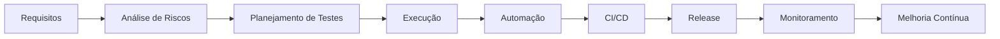

<h1 align="center">👋 Olá, eu sou Luis Gustavo</h1>

<p align="center">
  
</p>

<p align="center">
  <a href="https://linkedin.com/in/luis-gustavo-qa-automation">
    
  </a>
  <a href="https://github.com/ldelgado02">
    
  </a>
</p>

---

## 🧪 Sobre mim

Sou **Analista de QA** com **5+ anos de experiência em Qualidade de Software**, atuando principalmente em aplicações Web, APIs, integrações e produtos digitais.

Tenho experiência com **testes manuais, automação, API Testing, análise de requisitos, identificação de riscos e melhoria de processos de qualidade**.

Meu foco é construir processos de QA que não apenas encontrem bugs, mas que ajudem a **prevenir problemas e aumentar a confiabilidade das entregas**.

```diff
+ Quality Assurance
+ Test Automation
+ API Testing
+ Web Testing
+ Quality Processes
+ Continuous Improvement
```

---

## 🔍 O que eu faço

<table>
<tr>
<td>🧪 <strong>Testes</strong></td>
<td>Funcionais, regressão, integração, exploratórios, smoke e E2E</td>
</tr>

<tr>
<td>🤖 <strong>Automação</strong></td>
<td>Cypress para automação de fluxos Web e testes de regressão</td>
</tr>

<tr>
<td>🔌 <strong>APIs</strong></td>
<td>Testes e validações de APIs REST utilizando Postman e Swagger</td>
</tr>

<tr>
<td>🗄️ <strong>Banco de Dados</strong></td>
<td>Consultas e validações utilizando SQL e PostgreSQL</td>
</tr>

<tr>
<td>📋 <strong>Test Management</strong></td>
<td>Criação e gerenciamento de casos de teste utilizando Qase</td>
</tr>

<tr>
<td>📊 <strong>Quality Metrics</strong></td>
<td>Acompanhamento de indicadores e evolução da qualidade</td>
</tr>

<tr>
<td>⚙️ <strong>CI/CD</strong></td>
<td>Integração de automação com GitHub Actions</td>
</tr>

<tr>
<td>📝 <strong>BDD</strong></td>
<td>Criação de cenários utilizando Gherkin e Cucumber</td>
</tr>
</table>

---

## 🛠️ Stack & Ferramentas

### 🤖 Automação

<p align="center">
  
  
  
</p>

### 💻 Linguagens

<p align="center">
  
  
</p>

### 🔌 API & Database

<p align="center">
  
  
  
</p>

### ⚙️ Dev & CI/CD

<p align="center">
  
  
  
</p>

### 📋 QA & Management

<p align="center">
  
  
  
  
</p>

**Também utilizo:** Xray • Gherkin • BDD • Grafana • Kibana • Jaeger


---

## 🔄 Metodologias & Práticas

| 🏗️ Prática         | 🎯 Aplicação                                            |
| ------------------- | ------------------------------------------------------- |
| Scrum               | Trabalho colaborativo e entregas iterativas             |
| Kanban              | Organização e acompanhamento do fluxo de trabalho       |
| BDD                 | Cenários baseados no comportamento do sistema           |
| Gherkin             | Estruturação de cenários de teste                       |
| CI/CD               | Automação integrada ao processo de entrega              |
| Shift Left          | Identificação antecipada de riscos e problemas          |
| Exploratory Testing | Investigação e descoberta de comportamentos inesperados |

---

## 📊 QA no ciclo de desenvolvimento



---

# 🚀 Projetos em destaque

## 🏆 Inmetrics — Test Automation

Projeto de **automação de testes Web e API** desenvolvido para um desafio técnico de QA, utilizando **Cypress e JavaScript**.

### 🔎 Destaques

* Testes E2E de login, cadastro, busca, carrinho e checkout
* Testes de API com cenários positivos e negativos
* **Cucumber + Gherkin** para BDD
* **Page Object Model** para organização dos testes Web
* **Service Object** para testes de API
* Geração e limpeza automatizada de massa de dados
* **Allure Reports** para relatórios de execução

**Stack:** `Cypress` `JavaScript` `Cucumber` `Gherkin` `API Testing` `Allure`

<p align="left">
  <a href="https://github.com/ldelgado02/inmetrics">
    
  </a>
</p>

### ⭐ Destaques técnicos

* Cucumber + Gherkin para definição dos cenários
* Page Object Model
* Service Object para APIs
* Geração dinâmica de massa com Faker
* Data Provider para gerenciamento dos dados
* Data Cleaner para limpeza automática
* Variáveis de ambiente com `.env`
* Separação entre cenários positivos e negativos
* Execução seletiva por scripts npm
* Allure Reports para análise das execuções

A estratégia de geração e limpeza de massa foi estruturada em `DataFactory`, `DataProvider` e `DataCleaner`, com limpeza automática dos dados criados pela API após cada cenário.

### 🛠️ Stack

<p align="left">
  
  
  
  
</p>

**Padrões e práticas:**
`Page Object Model` `Service Object` `BDD` `Gherkin` `Data Factory` `Data Provider` `Data Cleaner`

<p align="center">
  <a href="https://github.com/ldelgado02/inmetrics">
    
  </a>
</p>

---

## 📫 Vamos conversar?

<p align="center">

<a href="https://linkedin.com/in/luis-gustavo-qa-automation">

</a>

<a href="mailto:luisgustavo220602@gmail.com">

</a>

</p>

<p align="center">
  <i>Quality is not just about finding bugs. It's about preventing them.</i>
</p>
